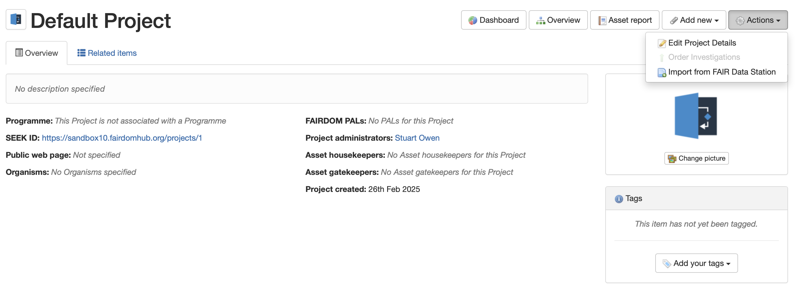
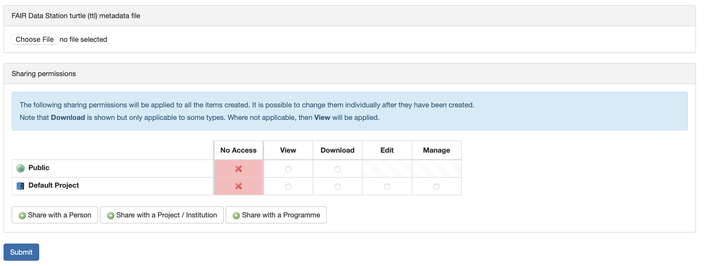
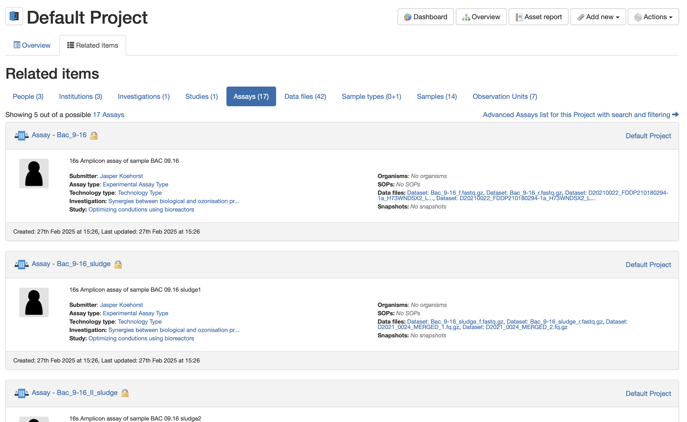

# FAIR Data Station & FAIRDOM-SEEK

## Introduction

This document provides guidance on how to populate the FAIRDOM-SEEK environment with your validated metadata file.

A sandbox environment has been created for you to practice the steps in this guide. The sandbox environment is a safe space for you to learn how to use FAIRDOM-SEEK without affecting the real data.

The sandbox environment is available at [https://sandbox10.fairdomhub.org](https://sandbox10.fairdomhub.org).

First you need to have access to a project within the FAIRDOM-SEEK environment. If you do not have access to a project, please create one.

After you have access to a project, you can start populating it with your metadata file.

Make sure you have the following file ready:
- A validated RDF file from your metadata excel file.

## Uploading the RDF file

To upload the RDF file, follow these steps:

- Log in to the FAIRDOM-SEEK environment.
- Go to the project where you want to upload the RDF file.
- Click on Actions
- Click on Import from FAIR Data Station

You can set the default permissions for all the entries that will be created by the content of the RDF file. By default no one will have access to the entries except you.

Feel free to change the permissions to your liking.

- Upload the RDF file by clicking on the "Choose File" button.
- Click on the "Submit" button.

***This might take a while depending on the size of the RDF file.***

## Checking the created entries

After the upload is complete, you can check the created entries in the project.

There you have it! You have successfully uploaded your metadata file to FAIRDOM-SEEK.