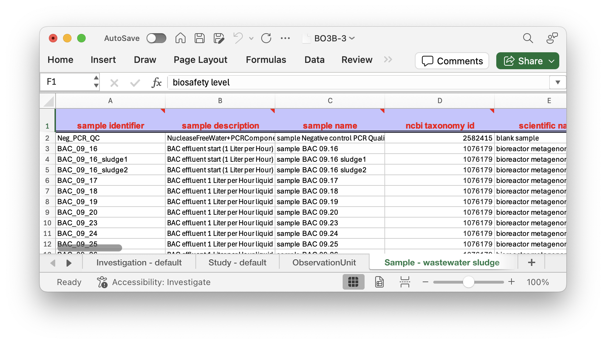

# Validation

In this tutorial we will show you how to use the FAIR Data Station which in turn allows you to work according to the FAIR By Design principles.

In this tutorial we will be working with a dataset that is publicly available under [PRJEB54921](https://www.ebi.ac.uk/ena/browser/view/PRJEB54921). In this study they analyzed the microbiam community of wastewater bioreactor experiments.

You will start with a prefilled metadata excelsheet. The sheets were generated using the open and free to use FAIR Data Station application, Metadata configurator fairds.fairbydesign.nl.

## Obtain the data

The metadata file can be obtained [here](https://github.com/ibisba/workshop/raw/refs/heads/main/ibisba_workshops/data/fairds/BO3B.xlsx).



As you can see there are different sheets corresponding to the different levels of information.

| **Level**       | **Description** |
|-----------------|-----------------|
| Investigation   | General research questions within the specified project & User access |
| Study           | A series of observation units to answer a particular biological question |
| ObservationUnit | Objects that are subject to instances of observation and measurement (Bioreactor, Patients, fields) |
| Sample          | Taken from an Observation Unit that can potentially be processed further to acquire data from |
| Assay           | The data (for example a sequencing run) that was performed on a sample |

## Exercise 1: Validating the metadata

While performing research the excel sheet can be continously populated. You can imagine that this can be done in the field while doing experiments, in the lab or by machines generating tabular information when a measurement or sample is taken.

During this registration process small mistakes are easily made and the validator in combination with the metadata schema in the backend will ensure that the predefined fields are conform a certain standard.

To validate this excel file go to [fairds.fairbydesign.nl](https://fairds.fairbydesign.nl) and click on the ***Validate Metadata*** button. You can now **drag** the excel file into the box at the top.

It will now start the validation...

As you can see it will start complaining about a field

> **Evaluation message**  
The value "5" of "biosafety level" in the "Sample" sheet which is obligatory  does not match the pattern of (1|2|3|4|unknown) regex (1|2|3|4|unknown) such as in example "2"

As you can see in the excel sheet in the "sample" sheet under "biosafety level"

| biosafety level |
|:---------------:|
| 1               |
| 2               |
| 3               |
| 4               |
| 5               |

You see that it is very likely that excel magic happend here. The only fields allowed as mentioned in the error message are ***(1|2|3|4|unknown)*** in this case all values should be of level **1**. Correct the values and evaluate again.

The evaluation message should now show:

> **Evaluation message**  
Analysing investigation information  
Analysing study information  
Analyzing observation unit sheet  
Finished processing Sample - wastewater sludge sheet  
Processing Assay - Amplicon demultiplexed sheet  
Finished parsing Assay - Amplicon demultiplexed sheet  
Validating RDF file: ./fairds_storage//validation/BO3B.ttl  
Validation successful, user not logged in.  
Result file not uploaded to the data storage facility  
**Validation appeared to be successful.**

## The validated RDF file

After the validation is successful you can download the RDF file. This file can be used to upload to a data repository. The RDF file is a machine readable format that can be used to automatically populate the fields in a data repository.

An example of an entry in the RDF file that describes a sample:

```turtle
<http://fairbydesign.nl/ontology/inv_BO3B/stu_BO3B-BR1/obs_BR1_BAC/sam_BAC_09_30>  
        rdf:type                     jerm:Sample ;
        fair:biosafety_level         1 ;
        fair:broad-scale_environmental_context
                "water stream" ;
        fair:collection_ph           7 ;
        fair:collection_temperature  "20 degrees celcius" ;
        fair:electron_acceptor_condition
                "Aerobic" ;
        fair:environmental_medium    "waste water" ;
        fair:flow_rate_l_h           1 ;
        fair:geographic_location_country_and_or_sea
                "Netherlands" ;
        fair:local_environmental_context
                "bioreactor" ;
        fair:local_storage_location  "-80 freezer at environmental technology. Moved to   microbiology freezers in december 2019" ;
        fair:material                "50 mL water" ;
        fair:packageName             "wastewater sludge" ;
        fair:reactor                 "BAC" ;
        fair:sample_condition        "Stored at -80" ;
        fair:sample_proces_key       "BAC Liquid 1" ;
        fair:sample_size             "50 mL" ;
        fair:sample_treatment        "50 mL sample was filtered with 0.2 a um filter,   the filter was stored in an eppendorf." ;
        fair:sample_types            "Effluent" ;
        fair:sampling_strategy       "Using sterilised metal rod, sample from middle of   the collumn, put in eppendorf and immidiately to -80 freezer" ;
        fair:solid_liquid            "Liquid" ;
        gbol:scientificName          "bioreactor metagenome" ;
        jerm:hasPart                 <http://fairbydesign.nl/ontology/inv_BO3B/stu_BO3B-BR1/obs_BR1_BAC/sam_BAC_09_30/asy_Bac_9-30> ;
        uniprot:organism             1076179 ;
        schema:description           "BAC effluent 1 Liter per Hour liquid" ;
        schema:identifier            "BAC_09_30" ;
        schema:name                  "sample BAC 09.30" ;
        mixs:0000009_lat             "5.19861927949498"^^xsd:double ;
        mixs:0000009_lon             "56.5968774411778"^^xsd:double ;
        mixs:0000011                 "2019-09-30"^^xsd:date .
```

## Conclusion

As you can see the FAIR Data Station can be used to validate metadata files. This is a very important step in the FAIR data lifecycle. The metadata file can be used to automatically populate fields in a data repository. This ensures that the data is FAIR and can be found and reused by **you** and others.

The result files can be obtained here: [RDF](https://raw.githubusercontent.com/ibisba/workshop/refs/heads/main/ibisba_workshops/data/fairds/BO3B-corrected.ttl) [XLSX](https://github.com/ibisba/workshop/raw/refs/heads/main/ibisba_workshops/data/fairds/BO3B-corrected.xlsx)