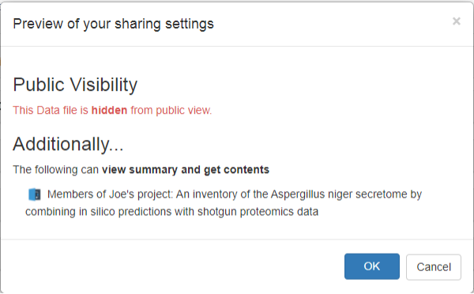
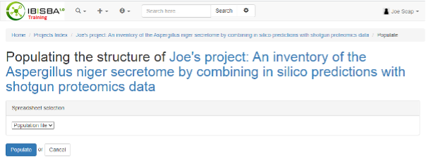

# Populating Your Project on IBISBAHub

## Purpose

At the end of this section, you will know how to:
- Define a spreadsheet for a project's ISA tree
- Upload it to a project
- Populate the project
- Alter parts of the ISA tree

## Context

The tree structure of Investigation -> Study -> Assay (ISA) can be created individually in the IBISBAHub interface. However, it is often easier to specify the entire tree in a single document.

## Steps

### Step 1: Understanding the Template

IBISBAHub allows an Excel spreadsheet to represent the tree. The spreadsheets must follow the IBISBA template. You can view the template on the Google Drive [population-template.xlsx](https://drive.google.com/file/d/18mFA8lpq2925U6UzrLUBSNRLzIDRJatq/view?usp=sharing).

The population template has columns for the Investigation, Study and Assay.

A realistic example of a population file that conforms to the template can be found [here](https://drive.google.com/file/d/17w-PbR7cPH_I22wBDHQ9Is3eTv_kgAX2/view?usp=sharing).

This corresponds to the ISA hierarchy for this [project](https://sandbox8.fairdomhub.org/projects/8).

### Step 2: Preparing Your Spreadsheet

#### Step 2a:
In this training, we will be using a simpler spreadsheet that can be downloaded from [population.xlsx](https://drive.google.com/file/d/1Oq04wF-OZwsh1Y3aMBLTJCoxANgqYBVq/view?usp=sharing).

#### Step 2b:
Download the Excel file and open it in Excel.

Add an Assay:
- "Obtain metabolic model"

Save the population file.

### Step 3: Uploading the Population File

#### Step 3a:
Click on "Data file" under the "Create" button.

#### Step 3b:
In the New Data file screen, you can upload the Excel file containing the ISA structure; select the "Local file" population spreadsheet that you just edited.

When you click "Upload" a metadata screen is shown.

#### Step 3c:
Make sure to enter the title and description. Make sure the correct project (with your name) is selected.

Click "End" and then, on the next screen, "Create".

#### Step 3d:
Once finished, a sharing summary is shown.

By default, all data that is uploaded will remain hidden to the public — but obviously not to you.

Click "OK" and the Data file will be created.

### Step 4: Populating Your Project

#### Step 4a:
When uploading has finished, the data file page is shown with the information that you provided.

#### Step 4b:
On your project page, select "Populate Project" from the "Actions" menu.

In the dropdown menu under Spreadsheet selection, select your Excel sheet and click "Populate". This will create the ISA structure for your project.

#### Step 4c:
Once the population is finished, the ISA structure from the Excel sheet is generated.

### Step 5: Editing Elements in the ISA Structure

If you check the names of the Assays, you will realize that "Identify enzymes from specta" should be called "Identify enzymes from spectra". Double-click on the assay in the tree.

#### Step 5a:
On the Assay's page select "Edit assay" from the "Actions" menu.

#### Step 5b:
Change the Title of the Assay and click "Update" at the bottom of the Edit page.

## Next Steps

Now proceed to Section 3.
